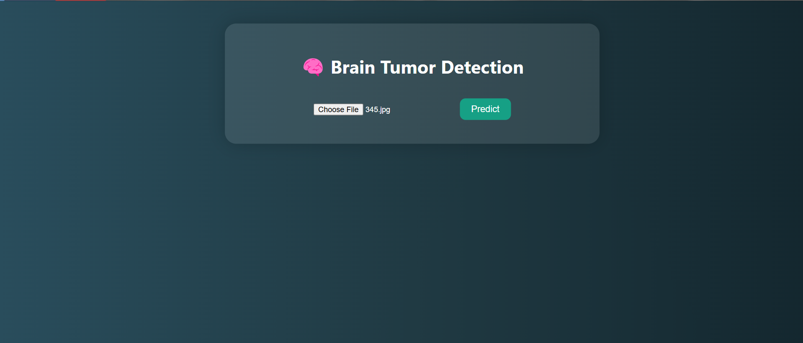
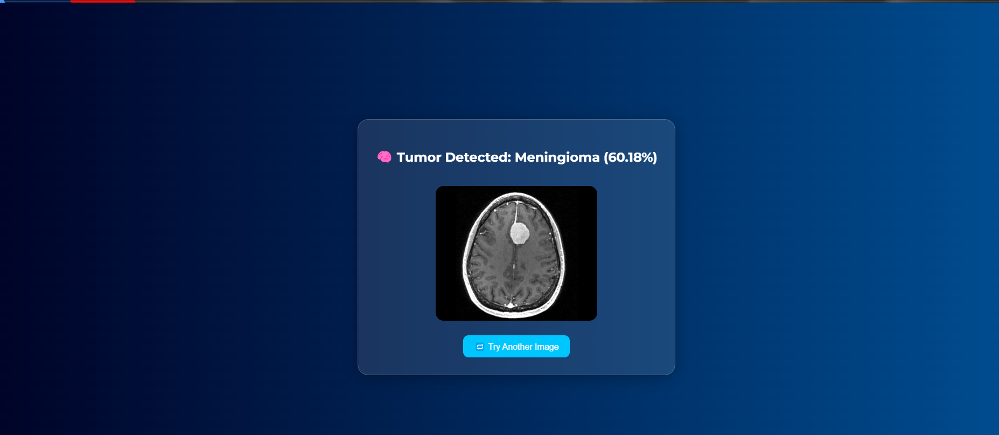
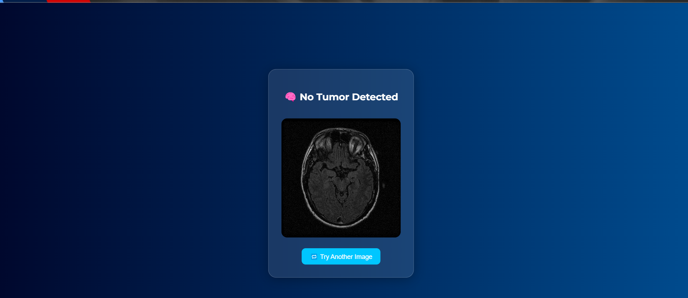
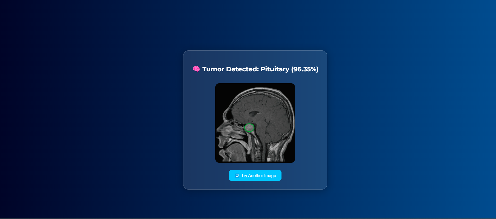
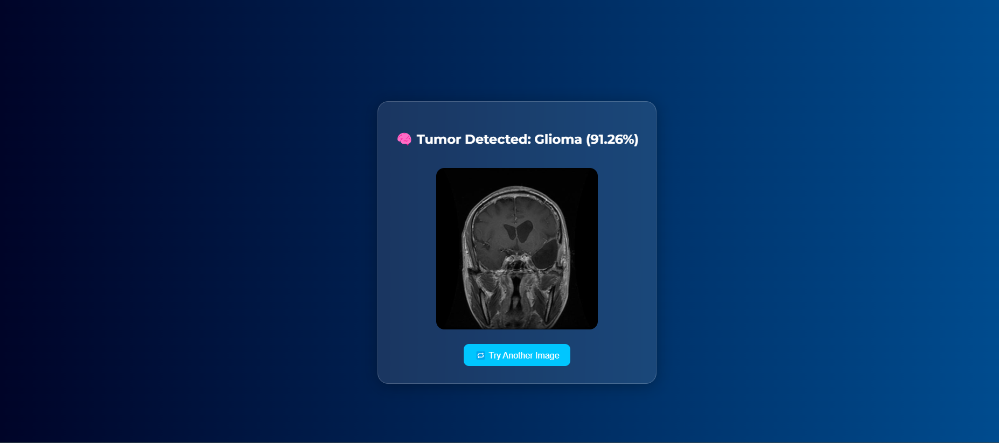

# 🧠 Brain Tumor Classification Using VGG16

A deep learning-powered web application to detect and classify brain tumors into four categories: **Glioma**, **Meningioma**, **Pituitary**, and **No Tumor** using **VGG16 transfer learning** and a simple **Flask-based web interface**.

---

## 🚀 Features

- ✅ Accurate classification using VGG16 and transfer learning  
- ✅ Fine-tuned Dense layers for improved performance  
- ✅ Clean and intuitive UI using Flask + HTML/CSS  
- ✅ Upload MRI scan and get prediction in real time  
- ✅ Visualization of prediction results  
- ✅ Easy to set up locally and deploy-ready for web apps  

---

## 🧠 Model Architecture
Base Model: VGG16 pretrained on ImageNet (with include_top=False, input shape (224, 224, 3))

Frozen Layers: All convolutional layers are frozen to prevent training during transfer learning

Custom Classification Head:

```bash
Flatten
↓
Dense(128, activation='relu')
↓
Dropout(0.5)
↓
Dense(4, activation='softmax')  # Output layer for 4 classes
Loss Function: Categorical Crossentropy

Optimizer: Adam with learning rate 0.0001

Training: 10 epochs with best model saved based on validation accuracy

```
## 📁 Project Structure

```bash
brain_tumor_detection/
│
├── model/
│ └── brain_tumor_model.keras # Saved Keras model
│
├── dataset/
│ ├── Training/
│ │ ├── glioma/
│ │ ├── meningioma/
│ │ ├── no_tumor/
│ │ └── pituitary/
│ └── Testing/
│ ├── glioma/
│ ├── meningioma/
│ ├── no_tumor/
│ └── pituitary/
│
├── static/
│ ├── uploads/ # Uploaded images
│ ├── images/ # Sample output images
│ │ ├── result1.png
│ │ ├── result2.png
│ │ ├── result3.png
│ │ ├── result4.png
│ │ └── result5.png
│ └── styles.css # CSS styling
│
├── templates/
│ ├── index.html # Upload page
│ └── result.html # Result display page
│
├── app.py # Flask application
├── train.py # Training script
├── predict.py # Inference script
├── requirements.txt # Project dependencies
└── README.md # Project documentation


---
```
## 📂 Dataset Structure

Organize the MRI dataset in the following format:
```bash
dataset/
├── Training/
│ ├── glioma/
│ ├── meningioma/
│ ├── no_tumor/
│ └── pituitary/
└── Testing/
├── glioma/
├── meningioma/
├── no_tumor/
└── pituitary/
```
📌 Dataset Source: [Kaggle Brain MRI Dataset](https://www.kaggle.com/navoneel/brain-mri-images-for-brain-tumor-detection)

---

## 📦 requirements.txt

Create a requirements.txt file in the root of your project with the following content:
```bash
Flask~=2.1.3
tensorflow~=2.10.0         # Includes keras, tensorboard, etc.
numpy~=1.21.6
Pillow~=9.1.0
matplotlib~=3.7.1
pandas~=1.5.2
opencv-python

```
## 🧪 Installation & Setup

### 📥 Step 1: Clone the Repository

```bash
git clone https://github.com/yourusername/Brain-Tumor-Classification-VGG16.git
cd Brain-Tumor-Classification-VGG16
```
🧰 Step 2: Create & Activate Virtual Environment

```bash
python -m venv venv
# Windows
venv\Scripts\activate
# macOS/Linux
source venv/bin/activate
```

## 📦 Step 3: Install Dependencies
```bash
pip install -r requirements.txt

```
## 🏋️ Step 4: Train the Model (Optional)
Make sure the dataset is properly placed under the dataset/ folder.
```bash
python train.py
```
This will train the model using VGG16 and save it as brain_tumor_model.keras under the model/ folder.

## 🌐 Step 5: Run the Web Application
```bash 
python app.py
Visit http://127.0.0.1:5000 in your browser.
```

## 🖼 Sample Results

### Web Application Interface

Below is the clean and user-friendly web interface where users can upload their MRI scans for brain tumor classification:



---

### Prediction Examples

Here are example MRI scans along with the model's predicted brain tumor class:

| Sample Image                 | Predicted Class      |
|-----------------------------|---------------------|
|  | **Meningioma**       |
|    | **No Tumor**         |
|   | **Pituitary Tumor**  |
|      | **Glioma Tumor**     |

---

This section showcases the application’s accuracy and ease of use, helping users quickly understand the system’s output.

📊 Sample Evaluation Metrics
Class	Precision	Recall	F1-Score
Glioma	95%	93%	94%
Meningioma	92%	91%	91.5%
No Tumor	98%	99%	98.5%
Pituitary	93%	95%	94%

## 🛠 Technologies Used

🧠 TensorFlow / Keras

🐍 Python 3.x

🌐 Flask (Web Framework)

🖼 HTML5, CSS3

📦 NumPy, Pandas

🧮 Matplotlib (optional for plotting)

🖼 Pillow / OpenCV (for image preprocessing)


## ✅ Future Enhancements

- Add explainability with Grad-CAM or LIME to visualize model decisions.  
- Support batch upload of multiple MRI scans for faster processing.
- Dockerize the app for easy deployment and scalability.   
- Build a REST API for easy integration with other healthcare tools and services.

## 💼 Use Cases

- 🧠 **Medical Imaging Assistance** – Help radiologists quickly classify brain MRI scans to support early tumor detection.  
- 🏥 **Healthcare Diagnostics** – Aid hospitals and clinics in automating brain tumor diagnosis workflows for faster patient care.  
- 📊 **Research & Development** – Provide a platform for researchers to experiment with transfer learning on medical image datasets.  
- 🎓 **Academic Projects** – Serve as a practical deep learning project for students learning medical AI applications.  
- 🌐 **Telemedicine Solutions** – Enable remote diagnosis by integrating with web or mobile apps for patients in underserved areas.  
- 🤖 **AI-powered Screening Tools** – Build smarter systems to pre-screen MRI scans and flag suspicious cases for expert review.


## 👤 Maintainer
Shabreen Taj 🔗 GitHub: @taj-shabreen


## ⭐️ Show Your Support
If you like this project, give it a ⭐ on GitHub and share it!
